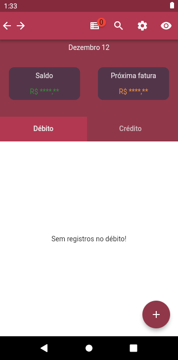
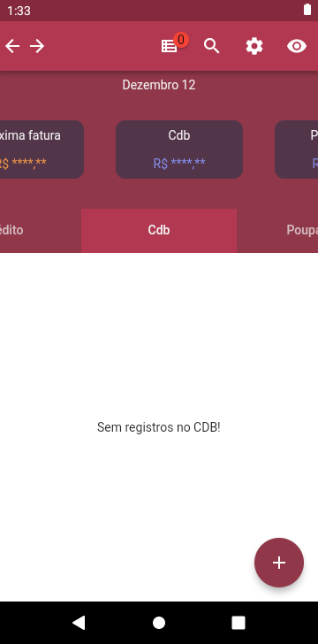
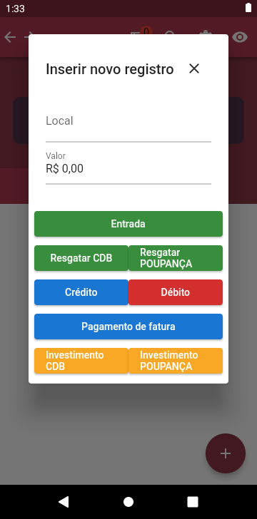
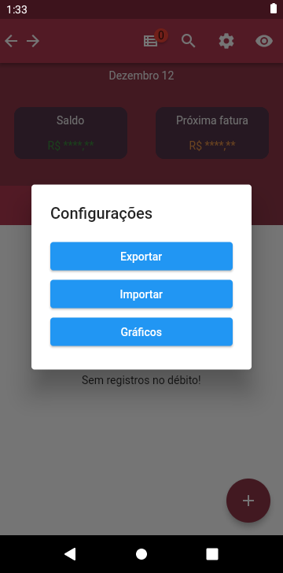
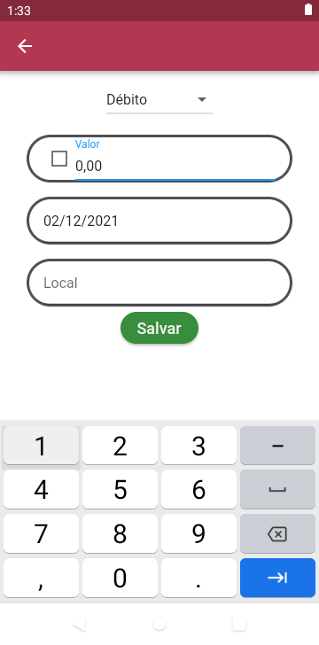

# Aplicativo MyPocket
Primeiramente gostaria de pedir desculpas por não disponibilizar o código fonte, ainda estou patenteando e pretendo postá-lo na playstore-appstore no inicio do próximo ano!

## Screenshots e como utilizá-lo

A primeira vez que abri-lo, ele irá aparecer assim:

Os botôes superiores são autoexplicativos, exceto o ícone de lista, que permite adicionar anotações para lembrar durante o periodo que utiliza o app.

O app também possui duas outras modalidades de registro, CDB e Poupança (não tive tempo para deixar personalizável)

Caso você segure o FAB (botao do canto inferior direito com um '+'), irá aparecer a janela de novo registro rápido, que eu mais utilizo para inserir os registros

O botão da appbar de configuração, exporta os dados e importa os dados da área de transferência, os gráficos ainda está em construção.

Caso você aperta o FAB abrirá a tela de adicionar registro (antigo), mas deixei-a por conta de extornos que podem ocorrer na função crédito (o checkbox sinaliza o valor como negativo)

## Outras informações
Qualquer problema por favor abra uma issue se desejar, no mais, desculpe novamente pela falta do código.

OBS, não precisa de internet para funcionar.
